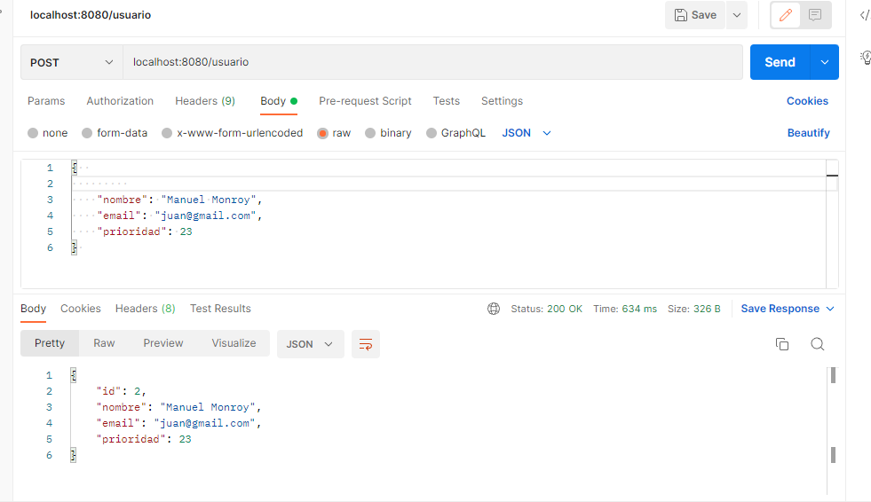

@ManyToOne es una de las anotaciones mas habituales a nivel de JPA y se encarga de generar una relacion de muchos a uno. 
SE realizaron pruebas unitarias con ActualizarUsuario y EliminarUsuario.

Generando post:
 

Actualizar: 
 

BD: 
